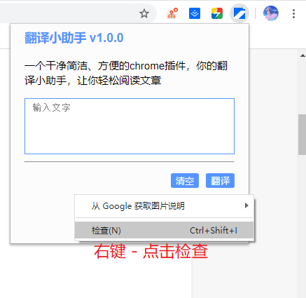
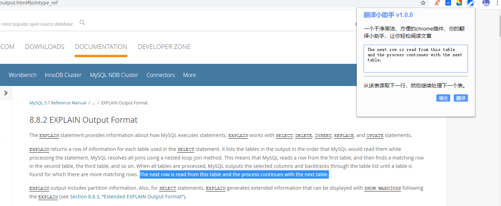

# 翻译小助手

一个干净简洁、方便的chrome插件，你的翻译小助手，让你轻松阅读外文。

本插件是为了阅读外文时，不用再来回切换去翻译，也不用再担心全文一键翻译然后狗屁不通。在阅读时遇到不懂单词，然后让你快速翻译。


## 安装
chrome浏览器 ——> 更多工具(L) ——> 扩展程序(E) ——> 加载已解压的扩展程序


## 预览和使用

阅读时，点击右键 - 检查，这样就能保持一直停靠在窗口了。如果你需要切换多个网页，建议你浏览器 打开新的窗口

 


在网页中双击要翻译的内容，或选择你要翻译的内容，稍后翻译小助手便会自动在右上角展示翻译结果。另外，你也可以手动输入文字，点击翻译即可。如需停止语音，请点击空白处



右键翻译小助手图标-选项，可进行系统设置


## 其他

本插件是基于百度通用翻译API的，使用的是标准版，限制是QPS(每秒访问量) = 1

你可以去[注册开通](http://api.fanyi.baidu.com/product/11)百度通用翻译，然后在[lib/popup.js](lib/popup.js)下修改 appid 和 key

查看appid 和 key: http://api.fanyi.baidu.com/api/trans/product/desktop


搜索关键字: appid 找到相应的内容修改appid 和 key
```
    // 自定义appid 和 key(密钥)
    var appid = '20200418000423327';
    var salt = (new Date).getTime();
    var key = 'w86l2KSP7GJbtB0rokYv';
```


